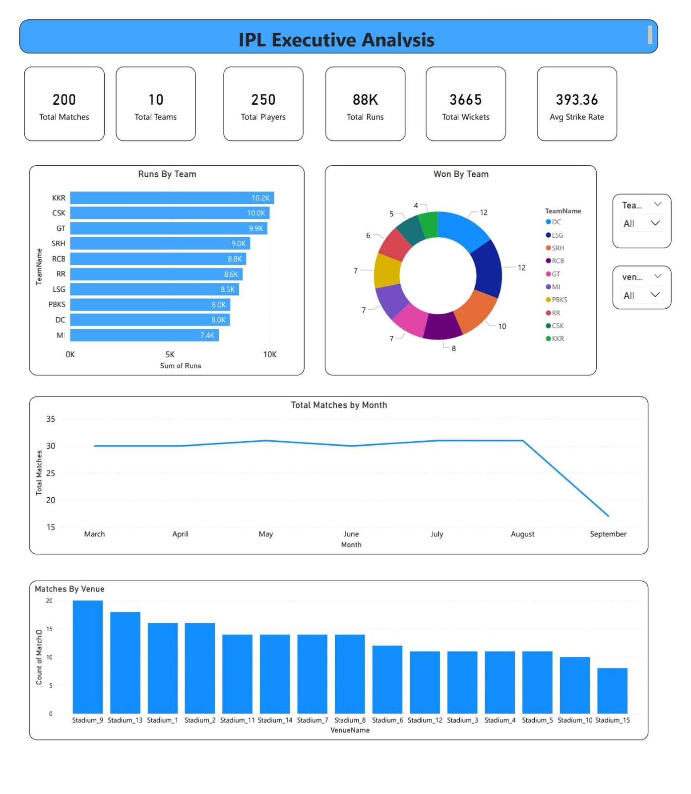

# 🏏 IPL Executive Analysis Dashboard

## 📌 Project Overview
An interactive Power BI dashboard built to analyze IPL data and provide meaningful insights.

## 🚀 Features
- Total Matches, Teams & Players
- Total Runs & Wickets
- Average Strike Rate
- Runs by Team
- Team-wise Wins
- Matches by Month
- Venue-wise Analysis
- Interactive Slicers

## 🛠 Tools Used
- Power BI
- Excel
- DAX
- Data Cleaning

## 📷 Dashboard Preview

## 📂 Files
- IPL_Dashboard.pbix
- IPL_Dataset.xlsx

## 👨‍💻 Author
Arjun Waghmare
